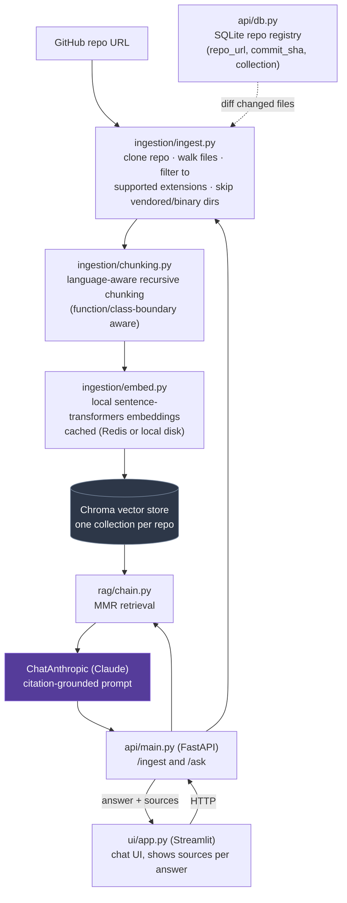
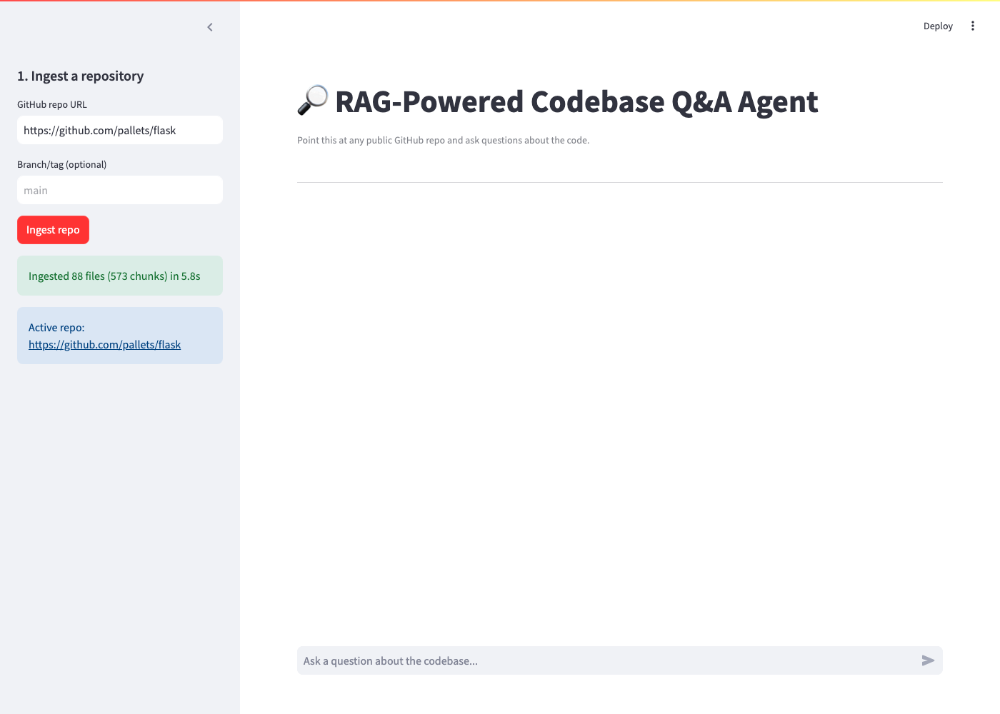
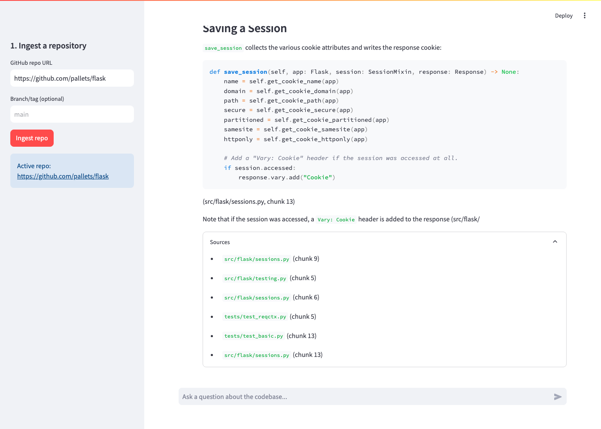

# RAG-Powered Codebase Q&A Agent

Point this at any public GitHub repository and ask natural-language questions
about its code. It clones the repo, chunks the source with language-aware
splitting, embeds the chunks (with a caching layer so re-ingestion is cheap),
and answers questions with a retrieval-augmented LLM that cites the exact
file and chunk it drew each claim from.

## Why this exists

Every engineering team eventually wants a way to ask "how does X work in
this codebase" without grepping blind. This project is an end-to-end,
from-scratch implementation of that idea: not a wrapper around a hosted RAG
product, but the actual pipeline -- chunking strategy, embedding cache,
retrieval strategy, and citation-grounded prompting -- built and reasoned
about explicitly.

## Architecture



## Key design decisions

- **Code-aware chunking, not fixed character windows.** Using
  `RecursiveCharacterTextSplitter.from_language(...)` per file type means
  chunk boundaries tend to fall on function/class edges instead of
  mid-statement, which measurably improves retrieval quality on code.
- **MMR retrieval instead of plain top-k similarity.** Codebases are full
  of near-duplicate chunks (imports, boilerplate). MMR trades a little raw
  similarity for diversity across the retrieved set, so the model doesn't
  get six near-identical chunks from the same file.
- **Local embeddings, hosted generation.** Anthropic doesn't offer an
  embeddings endpoint, so embeddings run locally via `sentence-transformers`
  (`all-MiniLM-L6-v2` by default) -- no API key or per-chunk cost -- while
  answer generation uses Claude (`ChatAnthropic`).
- **Cached embeddings.** Re-ingesting a repo (or ingesting a fork that
  shares most of its history) shouldn't re-pay for embeddings on unchanged
  chunks. `CacheBackedEmbeddings` sits in front of the local embedding
  calls; Redis is used if configured, otherwise a local file store.
- **Citation-required prompting.** The system prompt requires a
  `(file_path, chunk N)` citation for every claim, and the API returns the
  raw source list alongside the answer -- so the UI can show exactly which
  chunks the answer is (and isn't) grounded in.

## Running locally

### 1. With Docker Compose (recommended)

```bash
cp .env.example .env
# edit .env and set ANTHROPIC_API_KEY

docker compose up --build
```

- API: http://localhost:8000/docs
- UI: http://localhost:8501

### 2. Without Docker

```bash
python -m venv .venv && source .venv/bin/activate
pip install -r requirements.txt

cp .env.example .env
# edit .env and set ANTHROPIC_API_KEY
export $(grep -v '^#' .env | xargs)

uvicorn api.main:app --reload --port 8000
# in a second terminal:
streamlit run ui/app.py
```

### 3. Deploying (Render)

`render.yaml` defines both services as a Render Blueprint:

1. Push this repo to your own GitHub account.
2. In the Render dashboard: **New → Blueprint**, connect the repo. Render
   reads `render.yaml` and provisions the API and UI services.
3. When prompted, set `ANTHROPIC_API_KEY` on the API service (it's marked
   `sync: false` in the blueprint, so Render asks for it rather than
   storing it in the repo).
4. The UI service's `API_URL` is wired to the API service automatically
   via `fromService`.

Both services are on Render's free plan, which has no persistent disk --
the Chroma index and repo registry reset on every deploy/restart. Fine for
a demo; attach a Render disk (or move to Postgres + an external vector
store) for anything long-lived.

## Usage

1. Open the Streamlit UI, paste a GitHub repo URL (e.g.
   `https://github.com/octocat/Hello-World`), click **Ingest repo**.
2. Ask a question in the chat box. Each answer's **Sources** expander shows
   the exact files/chunks the model was given.

Or hit the API directly:

```bash
curl -X POST http://localhost:8000/ingest \
  -H "Content-Type: application/json" \
  -d '{"repo_url": "https://github.com/octocat/Hello-World"}'

curl -X POST http://localhost:8000/ask \
  -H "Content-Type: application/json" \
  -d '{"repo_url": "https://github.com/octocat/Hello-World", "question": "What does this repo do?"}'
```

### Screenshots

Ingesting `pallets/flask` (88 files, 573 chunks, 5.8s -- fast since
embeddings run locally):



Asking a real question and getting a cited, grounded answer:



## Testing

```bash
pytest -v
```

CI runs the same suite plus `ruff` linting on every push/PR (see
`.github/workflows/ci.yml`).

## Hardening

- **Persistent repo registry.** Which repos have been ingested (and at
  which commit) lives in a small SQLite table (`api/db.py`,
  `repo_registry.db`) instead of an in-memory set, so it survives API
  restarts.
- **Incremental re-ingestion.** A repeat `/ingest` call on a repo already
  in the registry diffs the new commit against the last-ingested one
  (`git diff --name-only`) and only re-chunks/re-embeds the files that
  actually changed -- stale chunks for edited or removed files are
  deleted from Chroma first. An `/ingest` call where nothing changed is a
  near-instant no-op.
- **Size and timeout guards.** `MAX_INGEST_FILES` / `MAX_INGEST_BYTES` cap
  a *full* first-time ingest and return `413` if a monorepo exceeds them;
  `INGEST_CLONE_TIMEOUT_SECONDS` bounds every git clone/fetch subprocess
  call and surfaces as `504` on a stalled network clone.
- **Structured retrieval logging.** Every `/ask` call logs which chunks
  were retrieved, retrieval latency, and generation latency
  (`rag-agent.retrieval` logger) so performance is debuggable in
  production.

## Retrieval eval

`scripts/eval_retrieval.py` runs 10 hand-written `(question, expected_file)`
pairs against a fixed test repo (`pallets/flask`) and reports
**hit-rate@k** -- did the file the answer should come from actually show up
in the top-k retrieved chunks?

```bash
python scripts/eval_retrieval.py            # default config (k=6, fetch_k=20, lambda_mult=0.75)
python scripts/eval_retrieval.py --sweep    # compare several k/fetch_k/lambda_mult configs
```

Sweeping `k`, `fetch_k`, and MMR's `lambda_mult` (relevance vs. diversity
tradeoff) over 3 repeated runs (Chroma's HNSW index is approximate-nearest-
neighbor, so results have some run-to-run variance at this sample size):

| k | fetch_k | lambda_mult | hit-rate@k (3 runs) |
|---|---------|-------------|----------------------|
| 4 | 15 | 0.5 | 70%, 70%, 70% |
| 6 | 20 | 0.25 | 70%, 80%, 80% |
| 6 | 20 | **0.5 (old default)** | 80%, 90%, 90% |
| 6 | 20 | **0.75 (new default)** | 90%, 90%, 90% |
| 8 | 30 | 0.5 | 90%, 90%, 90% |
| 10 | 40 | 0.5 | 90%, 90%, 90% |

Takeaways:
- **k=4 was the clearest bottleneck** -- consistently 70% across every run,
  well below every k≥6 config.
- **`lambda_mult=0.75` was the only config that hit 90% on all 3 runs** --
  `0.5` (the original default) dipped to 80% once. Weighting MMR more
  toward pure relevance and less toward diversity helped on this
  code-Q&A task, where near-duplicate chunks are less of a problem than
  in general-purpose retrieval.
- **k=8 and k=10 didn't beat k=6** on this eval set -- more retrieved
  chunks means more context tokens per question for no measured recall
  gain, so `k=6` stays the default.
- `rag/chain.py::build_rag_chain` now defaults to `k=6, fetch_k=20,
  lambda_mult=0.75` based on these results.

The one consistent miss: a question about `url_for` retrieves `app.py` /
`sansio/scaffold.py` / `sansio/app.py` instead of the file that actually
defines it (`helpers.py`) -- those files reference and re-export `url_for`
heavily, so they're genuinely close in embedding space to the question.
Diagnosing that kind of near-miss is exactly what this eval is for.

## Roadmap / known limitations

- SQLite is fine for a single API replica; running behind multiple
  replicas would need a real shared table (e.g. Postgres) instead.
- Incremental re-ingestion diffs by file path, not by chunk -- a one-line
  change still re-embeds the whole file's chunks, not just the edited
  region.

## Tech stack

Python · LangChain · ChromaDB · Claude (Anthropic) · sentence-transformers ·
FastAPI · Streamlit · Redis (optional embedding cache) · Docker Compose ·
GitHub Actions
